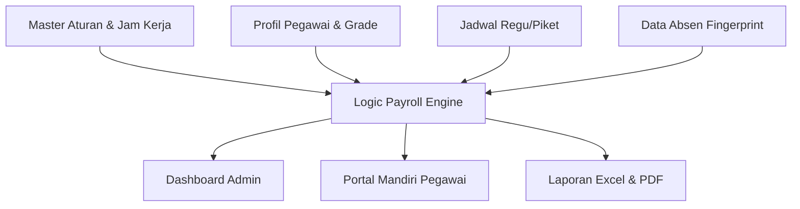

  
  
  # 🚀 Sinergi PAS
  ### **Sistem Informasi Kinerja Pemasyarakatan**
  **Lembaga Pemasyarakatan Kelas IIB Jombang**

  
  
  
  

---

## 📝 Deskripsi Proyek
**Sinergi PAS** (*Sistem Informasi Kinerja Pemasyarakatan*) adalah platform ERP (*Enterprise Resource Planning*) internal yang dirancang khusus untuk mentransformasi tata kelola administrasi di **Lembaga Pemasyarakatan Kelas IIB Jombang**. 

Sistem ini mengintegrasikan empat pilar utama birokrasi digital: **Manajemen Personel, Penjadwalan Operasional, Arsip Digital, dan Digital Payroll**. Dengan sistem ini, seluruh proses yang sebelumnya manual (Excel-based) kini berjalan secara otomatis, transparan, dan real-time.

---

## 🛠️ Modul & Fitur Utama (End-to-End)

### 👥 1. Manajemen Kepegawaian (Personnel)
Pusat database seluruh personel Lapas Jombang:
- **Profil Digital:** Database lengkap 109+ pegawai mencakup NIP, NIK, Pangkat/Golongan, Jabatan, dan Unit Kerja.
- **Riwayat Perubahan:** Audit log otomatis untuk setiap perubahan data profil (melacak nilai lama vs nilai baru).
- **Integrasi WhatsApp:** Tombol komunikasi instan untuk koordinasi cepat antar admin dan pegawai.

### 📅 2. Penjadwalan & Absensi (Smart Scheduling)
Sistem penjadwalan hirarkis yang mengatur operasional harian:
- **Manajemen Regu:** Pengaturan jadwal kolektif untuk Regu Pengamanan (RUPAM) dan Unit P2U (Pagi, Siang, Malam, Libur).
- **Piket Individual:** Fleksibilitas untuk mengatur penugasan khusus, dinas luar, atau izin personel secara mandiri.
- **Import Fingerprint:** Pengolahan data mentah mesin absensi menjadi informasi kedisiplinan (Menit telat, Pulang cepat).
- **Hirarki Prioritas:** Sistem cerdas yang memprioritaskan jadwal individu di atas jadwal regu untuk mencegah bentrok.

### 📂 3. Arsip Digital (Document Archive)
Ruang penyimpanan dokumen kedinasan yang teratur:
- **Kategori Terstruktur:** Pengelompokan berkas (SK, SKP, Ijazah, Sertifikat) dengan kategori wajib (*mandatory*).
- **Alur Verifikasi:** Sistem persetujuan berjenjang (Pending, Verified, Rejected, Revision Required).
- **Compliance Tracker:** Dashboard monitoring untuk melihat pegawai mana yang belum melengkapi dokumen wajib.

### 💰 4. Digital Payroll Engine (Tunkin & Uang Makan)
Inti dari sistem finansial yang patuh pada **Permenkumham No. 10 Tahun 2021**:
- **Kalkulasi Otomatis:** Perhitungan Tunjangan Kinerja (Tukin) berdasarkan 17 Kelas Jabatan (Grade).
- **Potongan Akumulatif Harian:** Deteksi otomatis TL 1-4, PSW, dan Mangkir yang diakumulasikan per hari.
- **Kompensasi Waktu:** Fitur "Tebus Telat" otomatis (Telat < 30m diganti dengan pulang +30m) sesuai aturan kementerian.
- **Status Khusus:** Dukungan kalkulasi untuk **CPNS (80%)**, **Tugas Belajar (Potong 100%)**, dan **Plt/Plh (+20% bonus)**.
- **Uang Makan (PMK):** Pembayaran otomatis berdasarkan kehadiran riil di hari kerja valid sesuai tarif golongan.

### 👤 5. Employee Self-Service (Portal Pegawai)
Memberikan transparansi penuh bagi setiap pegawai:
- **Dashboard Mandiri:** Monitor progres berkas pribadi dan status presensi harian.
- **Tunkin Saya:** Transparansi rincian gaji, total uang makan, dan detail rincian pelanggaran (TL/Mangkir) per tanggal.
- **Download Slip Resmi:** Unduh slip gaji resmi PDF yang telah divalidasi bendahara di Arsip Digital.

---

## ⚙️ Pusat Kendali Admin (Master Settings)
Administrator memiliki kontrol penuh untuk menyesuaikan sistem tanpa menyentuh kode:
- **Master Aturan Payroll:** Mengubah persentase potongan denda dan batas maksimal keterlambatan secara dinamis.
- **Konfigurasi Jam Kerja:** Pengaturan jam masuk/pulang kantor (mendukung jam khusus hari Jumat).
- **Manajemen Unit & Jabatan:** Pengaturan struktur organisasi yang fleksibel.

---

## 📈 Alur Integrasi Data

---

## 🛠️ Spesifikasi Teknis & Optimasi
- **Framework:** Laravel 11 (Latest Stable)
- **Frontend:** Tailwind CSS (Modern Card-based UI)
- **Performance:** Database Pre-fetching (Fix N+1 Query) untuk proses kalkulasi instan.
- **Security:** Role-Based Access Control (Superadmin vs Pegawai) & Session Protection.
- **Optimization:** Base64 Image Injection pada PDF Engine untuk proses export dokumen yang ringan.

---

## 👔 Identitas Satuan Kerja
**Kementerian Imigrasi dan Pemasyarakatan RI**
**Lembaga Pemasyarakatan Kelas IIB Jombang**
📍 Jl. KH. Wahid Hasyim No. 151, Jombang
📞 (0321) 861114

---

  Dibuat dengan ❤️ untuk Masa Depan Pemasyarakatan yang Lebih Digital dan Akuntabel.

