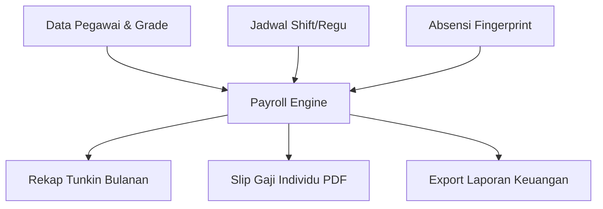

<div align="center">
  
  
  # 🚀 Sinergi PAS
  ### Sistem Informasi Manajemen Kepegawaian & Payroll Terpadu
  **Lembaga Pemasyarakatan Kelas IIB Jombang**

  [](https://laravel.com)
  [](https://php.net)
  [](https://mysql.com)
  [](https://tailwindcss.com)
</div>

---

## 📝 Tentang Proyek
**Sinergi PAS** adalah platform internal untuk manajemen database kepegawaian di Lapas Jombang. Sistem ini dirancang untuk menggantikan perhitungan manual menjadi otomatis, mencakup pengelolaan data pegawai, jadwal shift regu jaga, absensi fingerprint, hingga perhitungan **Tunjangan Kinerja (Tunkin)** dan **Uang Makan** secara real-time.

---

## ✨ Fitur Unggulan

### 🛡️ 1. Payroll & Tunkin Engine (Permenkumham No. 10 Th 2021)
Mesin perhitungan otomatis yang menyinkronkan data kehadiran dengan hak finansial:
- 📊 **17 Kelas Jabatan (Grade):** Pengaturan nominal dasar tunkin per grade.
- 📉 **Potongan TL & PSW Otomatis:** Perhitungan 0,5% s.d 1,5% berdasarkan menit keterlambatan riil.
- 🤒 **Sakit Progresif:** Deteksi akumulasi hari sakit (Hari 3-6: 2,5%, Hari 7+: 10%).
- 🚫 **Mangkir Detection:** Sinkronisasi Jadwal vs Absen; Jika bolos jadwal otomatis potong 5%.
- ⚠️ **Pelanggaran System:** Peringatan otomatis jika telat > 8 kali dalam sebulan.

### 🍱 2. Uang Makan (PMK Standar)
- 💰 **Tarif Berdasarkan Golongan:** Sinkronisasi otomatis (Gol IV: 41k, III: 37k, I/II: 35k).
- ✅ **Validasi Kehadiran Riil:** Hanya membayar pada hari kerja valid (menghindari double payment saat dinas luar).

### 📅 3. Manajemen Regu & Jadwal Shift
- 👥 **Struktur Unit:** Pengelompokan pegawai ke dalam Regu Pengamanan (RUPAM) dan P2U.
- 🔄 **Jadwal Dinamis:** Pengaturan shift Pagi, Siang, Malam, dan Libur yang langsung terhubung ke payroll.

### 🖥️ 4. Dashboard & Reporting
- 📊 **Real-time Recap:** Monitor THP (Take Home Pay) seluruh pegawai dalam satu layar.
- 📄 **Official Export:** Cetak Slip Gaji (PDF) dan Rekapitulasi (Excel/PDF) dengan Kop Surat Resmi Lapas Jombang.
- ⚙️ **Master Rules:** Kendali penuh bagi admin untuk mengubah jam kerja dan persentase potongan secara live.

---

## 🛠️ Tech Stack
- **Backend:** Laravel 11 (PHP 8.2)
- **Frontend:** Blade Templating + Tailwind CSS
- **Icons:** Lucide Icons & FontAwesome
- **Components:** SweetAlert2 (Notifikasi Premium), AOS (Animate on Scroll)
- **Export Engine:** Barryvdh DomPDF & Maatwebsite Excel

---

## 🚀 Instalasi Cepat

1. **Clone Repositori**
   ```bash
   git clone https://github.com/username/sinergi-pas.git
   cd sinergi-pas
   ```

2. **Instal Dependencies**
   ```bash
   composer install
   npm install && npm run build
   ```

3. **Konfigurasi Environment**
   ```bash
   cp .env.example .env
   php artisan key:generate
   ```

4. **Setup Database**
   ```bash
   php artisan migrate --seed
   ```

5. **Jalankan Aplikasi**
   ```bash
   php artisan serve
   ```

---

## 📜 Alur Kerja Sinkronisasi Data


---

## 👔 Identitas Satuan Kerja
**Kementerian Imigrasi dan Pemasyarakatan RI**
**Lembaga Pemasyarakatan Kelas IIB Jombang**
📍 Jl. KH. Wahid Hasyim No. 151, Jombang
📞 (0321) 861114

---
<div align="center">
  Dibuat dengan ❤️ untuk kemajuan birokrasi digital di lingkungan PAS
</div>
